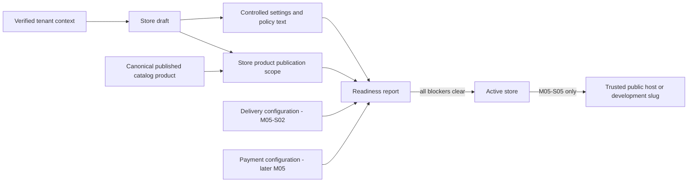

# M05-S01 — Storefront Administration Plan

**Status:** `REVIEW`  
**Scope:** Store domain, seller administration APIs, readiness, and seller-controlled product publication only.  
**Implementation is complete and awaits project-owner review.**

## 1. Outcome and boundary

This step establishes the seller-owned Store aggregate that will later be resolved by a trusted platform subdomain and used by quote, checkout, and order services. It does **not** make a store public or purchasable yet.

The authoritative ownership chain is:

The browser is never authoritative for a store's tenant, slug ownership, product eligibility, readiness, or public availability. Seller administration uses the verified `X-Kreyora-Tenant-Id` selection flow from ADR-003; public host/slug resolution is deliberately deferred to M05-S05.

## 2. Locked decisions for this step

| Decision | M05-S01 rule |
|---|---|
| Store versus tenant | `Store` is a first-class tenant-owned aggregate; it is not an alias of `Tenant`. This keeps a future multi-store entitlement possible. |
| MVP entitlement | At most one `Active` store belongs to a tenant. Draft or historical stores never become public; activating a second store is rejected. Multi-active-store support needs an explicit later entitlement/ADR decision. |
| Platform slug | Each store has a globally unique, normalized 3–80-character lowercase slug matching `^[a-z0-9]+(?:-[a-z0-9]+)*$`. It is distinct from the tenant/workspace slug. |
| Platform convention | Development continues to use `/store/{storeSlug}` only as a fixture/UI route until M05-S05. Pilot production convention is `https://{storeSlug}.{Storefront:PlatformDomain}`. The API will not trust an arbitrary `Host` header or arbitrary tenant header for public reads. |
| Theme boundary | Seller input is limited to an optional validated `#RRGGBB` brand accent and a code-owned theme preset (initially `Default`). No CSS, JavaScript, arbitrary HTML, templates, or external style URLs are stored. |
| Policy boundary | Terms, privacy, returns/refunds, and payment-policy content are bounded plain text/Markdown-free text. Public rendering later escapes it; sellers cannot store executable or raw HTML policy markup. |
| Product scope | A Store may expose only products explicitly included in `StoreProductPublication` **and** currently published by the canonical Catalog aggregate. Store inclusion never changes price, stock, product publication state, or variant facts. |
| Readiness | Readiness is computed from canonical state and returns stable machine-readable blocker codes. It cannot be overridden by a browser field or an administrator toggle. |

No new ADR is needed: these choices implement the existing authoritative storefront design in `plan.md` §10.8–10.10 and the M05 prompt. Any change to multi-store entitlement, arbitrary themes, custom domains, or public host trust requires a proposal before implementation.

## 3. Store model

### 3.1 Aggregate and lifecycle

`Store` implements `ITenantOwned` and follows the existing `BaseEntity` timestamp/version conventions.

| Field | Rule |
|---|---|
| `Id`, `TenantId` | Server-generated ID and verified tenant context only. |
| `Status` | `Draft`, `Active`, or `Suspended`. Seller APIs create and edit `Draft`; activation is rejected while any readiness blocker remains. Suspension is retained for a later authorized platform operation, not exposed as a seller bypass. |
| `DisplayName` | Required, trimmed, maximum 160 characters. |
| `PlatformSlug`, `NormalizedPlatformSlug` | Required immutable-at-activation public identifier; normalized using the tenant-slug rule and globally unique. A draft may rename it with optimistic concurrency. |
| `Tagline` | Optional, trimmed, maximum 280 characters. |
| `ThemePreset`, `BrandAccentHex` | Controlled code enum plus optional six-digit hex accent; no arbitrary theme payload. |
| `Contact` | Optional seller-maintained public contact name, email, phone, WhatsApp, and social profile URLs with bounded, normalized validation. It does not create a Customer record. |
| `Policies` | Optional bounded terms, privacy, returns/refunds, and payment-policy text. Each required policy must be nonblank before activation; content is not legal advice or a fabricated policy. |
| `ActivatedAt` | Server timestamp set once on successful `Draft → Active`; never supplied by the browser. |
| concurrency | Existing PostgreSQL `xmin`/expected-version convention prevents silent stale seller updates. |

`StoreSettings` may be represented as a private value object/owned EF component within the Store aggregate rather than a separate service or tenant table. Aggregate methods validate each update and never accept a wholesale untyped JSON document.

### 3.2 Product publication scope

`StoreProductPublication` is a tenant-owned association, not a Catalog mutation.

| Field | Rule |
|---|---|
| `StoreId`, `ProductId`, `TenantId` | All must belong to the verified tenant. Cross-tenant IDs are indistinguishable from not found. |
| `Visibility` | `Visible` or `Hidden`; only `Visible` entries count toward catalog readiness. |
| timestamps/version | Server-owned; visible/hidden operations are optimistic-concurrency and idempotency protected. |

The service validates the product through a stable Catalog read contract. A product must remain `Published` and contain a purchasable published variant; a later catalog unpublish immediately stops it counting as storefront-ready even if its association remains in the database.

### 3.3 Persistence and migration

Add `stores` and `store_product_publications` through one forward-only EF Core migration, mappings, DbSets, tenant query filters, and `AppDbContext.EnforceTenantOwnership` coverage.

Required constraints and indexes:

- globally unique `stores.normalized_platform_slug`;
- PostgreSQL partial unique index on `stores.tenant_id` for `status = Active`;
- seller lookup index `(tenant_id, status)`;
- unique `(store_id, product_id)` and lookup `(tenant_id, product_id, visibility)` for publication scope;
- foreign keys constrained to same-tenant application validation; database constraints/indexes protect relational consistency without exposing another tenant's data;
- `xmin` concurrency mapping for store and publication updates.

Add a dedicated append-only `StoreCommandIdempotency` record, following the existing catalog/inventory command pattern. Its unique key is `(tenant_id, operation, idempotency_key)` and it stores request fingerprint and successful resource identity. It is not reused across Catalog or Inventory operations.

## 4. Readiness contract

`IStoreReadinessService` computes the result on every seller read and activation attempt. It returns sections and blockers, not a persisted boolean.

| Section | Ready when | Current M05-S01 behavior |
|---|---|---|
| `profile` | Display name, platform slug, valid settings/contact requirements are present. | Implemented. |
| `policies` | Required seller-provided policy text is present. | Implemented. |
| `catalog` | At least one visible Store publication resolves to a canonical published product with a published purchasable variant. | Implemented through Catalog read contract. |
| `delivery` | A valid delivery rule can quote the destination. | Explicit blocker `delivery_not_configured` until M05-S02; no fake rule or bypass. |
| `payments` | At least one permitted payment method is configured for the store. | Explicit blocker `payment_not_configured` until the payment configuration boundary is implemented. |

The response contains `canActivate`, `canAcceptOrders` (both false while any blocker exists), and a stable array of `{ code, section }`. Human-readable text remains a frontend concern for this administration response; no general validation/localization system is introduced in this step.

Activation is a service operation, not a writable `isPublished` field. It re-evaluates readiness inside the operation and returns a typed validation result listing every blocker. Even after activation, M05-S05 must independently require active **and** ready state before exposing any public route or accepting a purchase.

## 5. Service, authorization, audit, and HTTP design

Follow ADR-001: Application contracts/interfaces, Infrastructure service implementation, and thin `[ApiController]` endpoints. No MediatR/CQRS or direct controller repository access.

### 5.1 Application operations

- `GetStoreAsync`, `CreateStoreAsync`, `UpdateStoreAsync`, `GetReadinessAsync`, and `ActivateStoreAsync`;
- `ListPublicationsAsync`, `SetProductVisibilityAsync`, and `HideProductAsync`;
- typed request/response contracts and typed expected results for absent store/product, duplicate slug, stale version, invalid transition/readiness, and idempotency mismatch;
- `IStorefrontCatalogReadService` (or an equivalent stable Catalog application query) rather than direct Storefront-to-Catalog repository access.

### 5.2 Permissions

Introduce `storefront.read` and `storefront.write` in `TenantPermissions` and its existing role matrix:

- Owner/Admin: read and write;
- Operator: read and write;
- Viewer: read only;
- read-only PlatformSupport: neither, because Store settings/policies can contain customer-facing and contact information and M05 does not add a support grant capability for them.

All seller endpoints require authenticated Identity, verified tenant context, and the matching permission. A forged tenant selection cannot find or mutate a Store or publication outside an active membership (ADR-003).

### 5.3 Seller endpoints

| Endpoint | Purpose | Permission |
|---|---|---|
| `GET /v1/store` | Current tenant's store administration view. | `storefront.read` |
| `POST /v1/store` | Create a draft store; requires `Idempotency-Key`. | `storefront.write` |
| `PUT /v1/store` | Update bounded settings with expected version. | `storefront.write` |
| `GET /v1/store/readiness` | Computed blocker report. | `storefront.read` |
| `POST /v1/store/activate` | Re-evaluate then activate only if ready; requires `Idempotency-Key`. | `storefront.write` |
| `GET /v1/store/publications` | Paginated seller inclusion list. | `storefront.read` |
| `PUT /v1/store/publications/{productId}` | Set visible/hidden state with expected version and idempotency key. | `storefront.write` |

Controllers map typed outcomes to the repository's standard RFC 7807/problem result conventions. They do not return database exception messages, another tenant's ID, an object-storage key, or a public URL that claims a store is live.

Successful mutations append safe audit events such as `store.created`, `store.settings.updated`, `store.product.visible`, `store.product.hidden`, and `store.activated`. Metadata contains resource IDs and safe state changes only—never policy body, contact address, phone number, email, or idempotency key.

## 6. Implementation sequence

1. Inspect current M04 Catalog contracts, `AppDbContext`, permission/audit/idempotency conventions, generated API artifacts, and fixture-only storefront administration port.
2. Add Store domain types, aggregate methods, StoreProductPublication, and unit tests for normalization, settings bounds, theme safety, lifecycle, and publication eligibility.
3. Add application contracts/services and typed expected results; add `storefront.read/write` to the policy matrix.
4. Add EF mappings, query filters, constraints/indexes, command-idempotency entity, migration, and PostgreSQL/Testcontainers integration tests.
5. Implement the Storefront administration service with verified tenant context, Catalog read contract, computed readiness, activation guard, idempotency, optimistic concurrency, and audit events.
6. Add thin authenticated seller controller endpoints, problem mappings, OpenAPI coverage, and generated TypeScript snapshot updates.
7. Keep `apps/web` storefront and seller administration adapters in explicit fixture/demo mode. M05-S06—not this step—will replace them with real clients and UI mutation/recovery flows.
8. Run the complete backend/frontend quality gates, inspect Docker state, then remove Testcontainers-created containers and images without deleting project data volumes.

## 7. Verification matrix

| Area | Required proof |
|---|---|
| Store domain | Invalid/overlong names, invalid/global slug normalization, disallowed accent/theme input, policy bounds, invalid lifecycle transitions. |
| Entitlement | Two simultaneous activation attempts for one tenant leave exactly one active store; active-store partial unique index is exercised against PostgreSQL. |
| Slug safety | Same platform slug across tenants returns one safe duplicate conflict; no tenant identity leaks. |
| Publication | Foreign, archived, draft, unpublished, or no-valid-variant products cannot become visible; valid published product can; later product unpublish removes readiness. |
| Readiness | Every missing section yields its stable blocker; activation cannot bypass catalog, delivery, or payment blockers. |
| Tenant and RBAC | Missing/forged tenant selection, Viewer write, PlatformSupport read/write, foreign store/product IDs, and Owner/Admin/Operator paths. |
| Idempotency/concurrency | Same command/key replay has one effect; changed payload with reused key conflicts; stale settings/publication version conflicts safely. |
| Audit/privacy | Events exist for allowed mutations and contain no policy/contact content; unauthorized attempts create no event. |
| Contract | Exact endpoint response/problem shapes appear in OpenAPI and regenerated TypeScript contract. |
| Regression | `dotnet format --verify-no-changes` may be run locally but is not a CI gate; solution test suite, frontend lint/typecheck/tests/build, and `git diff --check` pass. |

Backend integration tests use Testcontainers PostgreSQL, not an in-memory provider. At the end of test execution, confirm no test container remains and remove only disposable Testcontainers images (`postgres:16-alpine`, `testcontainers/ryuk`) when unreferenced; preserve named development volumes and project containers.

## 8. Explicitly deferred

- Public host/path resolution, cache headers, public catalog reads, and host-confusion controls (M05-S05).
- Delivery rules, destination matching, quotes, fees, and COD availability (M05-S02).
- Customers, address retention, checkout sessions, cart reservations, and expiry (M05-S03).
- Canonical orders, financial snapshots, COD/QR state initialization, and order outbox (M05-S04).
- Seller/admin and public frontend real-client wiring, mutations, and customer E2E flow (M05-S06).
- Custom domains, DNS/TLS, arbitrary templates/CSS, live payment gateways, tax/legal claims, and multi-active-store entitlement.

## 9. Review checklist

- Confirm a Store is independent from a Tenant but the MVP allows only one active store per tenant.
- Confirm the platform slug convention and that public resolution is deferred to M05-S05.
- Confirm controlled theme/policy inputs prevent stored executable/custom presentation content.
- Confirm readiness exposes all blockers and cannot be overridden or made public early.
- Confirm Store publication is an additional inclusion gate and never changes canonical Catalog facts.
- Confirm all seller writes require verified tenant context, permission, idempotency, concurrency handling, and safe audit events.
- Confirm no M05-S02+ capability is implemented as part of M05-S01.
