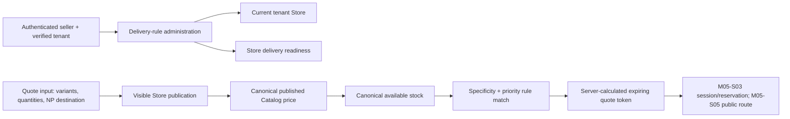

# M05-S02 — Delivery Rules and Server-side Quote Plan

**Status:** `REVIEW`  
**Scope:** Seller delivery-rule administration, delivery readiness, and a deterministic internal quote engine.  
**Implementation was approved and is complete; project-owner review is required before Graphify is refreshed or M05-S03 planning begins.**

## 1. Outcome and boundary

M05-S02 makes delivery a server-owned configuration and calculation concern. A seller can define bounded delivery coverage, fee rules, ETA text, and COD eligibility. The backend can then calculate a quote from canonical Catalog, Store publication, Inventory availability, and matching DeliveryRule facts.

This step deliberately does **not** expose public store, quote, cart, checkout, customer, payment-configuration, reservation, or order endpoints. M05-S05 owns trusted public store resolution and public API exposure; M05-S03 owns checkout sessions and stock reservations; M05-S04 owns canonical orders. The existing fixture-only frontend remains unchanged until M05-S06.



The browser may submit destination and cart intent but cannot choose a fee, price, rule result, COD eligibility, store, or tenant. A quote has no reservation and cannot create an order in this step.

## 2. Locked decisions

| Decision | M05-S02 rule |
|---|---|
| Scope | Rules belong to the current tenant's single seller-managed Store, not directly to the Tenant or an arbitrary browser-supplied store ID. |
| Country | MVP delivery is Nepal-only. Request country must normalize to `NP`; carrier APIs, postcode rates, geocoding, and cross-border delivery are deferred. |
| Coverage | A rule contains one or more zones: required `District`, optional `Municipality`, optional `Locality`. Values are trimmed, bounded, and case-folded for exact normalized matching; raw normalized input is never treated as an external geocoding claim. |
| Winner | A matching locality zone outranks municipality, which outranks district. Equal specificity resolves by lower numeric `Priority`, then a stable server tie-breaker. This makes the result deterministic. |
| Fee | Every active rule has `BaseFeeNpr >= 0`. A `Threshold` rule is free when merchandise subtotal is at least `FreeAboveNpr`; otherwise it charges BaseFee. A `Flat` rule always charges BaseFee. Currency is fixed to NPR. |
| COD | `CodAvailable` is delivery eligibility only. It does not configure or imply a merchant QR method, gateway, collection workflow, or payment success. |
| Order bounds | Minimum and maximum order constraints are not implemented in this step because no product/operational policy has approved their semantics. They remain an explicit future proposal. |
| Quote identity | Quotes are stateless, server-protected, opaque, and short-lived (default 10 minutes, typed bounded configuration). The protected payload has no customer name, phone, email, or address line. M05-S03 revalidates all facts before reserving stock. |
| Public boundary | There is no `/public/.../quote` controller in M05-S02. The quote application service is directly tested and can later be called only after M05-S05 establishes a trusted store/tenant context. |

These decisions implement the accepted Storefront, delivery, tenant, and service-layer architecture. No ADR is needed. Any change to public route convention, payment policy, delivery country, a live carrier provider, or stored customer address requires a separate proposal/ADR where applicable.

## 3. Domain and persistence model

### 3.1 Delivery rule aggregate

`DeliveryRule` is tenant-owned and belongs to the current Store.

| Field | Rule |
|---|---|
| `Id`, `TenantId`, `StoreId` | Server-owned and verified from the selected seller context. |
| `Name` | Required trimmed label, maximum 160 characters. |
| `Priority` | Integer `0..10000`; lower number wins after coverage specificity. |
| `FeeType` | `Flat` or `Threshold`; controlled enum only. |
| `BaseFeeNpr` | Non-negative, two-decimal NPR amount. |
| `FreeAboveNpr` | Required and positive only for `Threshold`; unavailable for `Flat`. |
| `EstimatedEtaText` | Optional seller-entered plain text, maximum 120 characters; it is not a carrier promise. |
| `CodAvailable` | Seller-controlled delivery eligibility switch. |
| `IsActive` | Inactive rules are retained and never match a quote or satisfy readiness. No hard delete endpoint is introduced. |
| `Zones` | One to 50 normalized `DeliveryRuleZone` records. District is required; municipality/locality refine a district. Duplicate normalized zones in a rule are rejected. |
| `xmin` | Existing optimistic concurrency convention. |

Add `delivery_rules` and `delivery_rule_zones` through one forward-only EF Core migration. Required indexes/constraints:

- `(tenant_id, store_id, is_active, priority)` for active rule lookup;
- `(delivery_rule_id, normalized_district, normalized_municipality, normalized_locality)` unique coverage identity;
- same-tenant composite foreign key from rule to Store;
- cascade delete from a rule to its zones only; Store delete remains restricted;
- tenant query filters, `AppDbContext.EnforceTenantOwnership`, mappings, and `xmin` concurrency for `DeliveryRule`.

### 3.2 Quote contract and lifecycle

The quote is a protected snapshot, not a persisted checkout session and not an Inventory reservation.

```text
Draft seller delivery rules
  → rule selected by normalized destination
  → validated visible products / published variants / current price
  → current available stock check
  → immutable quote payload, expiresAt, opaque protected quoteToken
  → M05-S03 revalidates token facts and creates the actual reservation
```

`DeliveryQuote` contains only:

- quote ID, Store ID, expiry, currency `NPR`;
- line snapshots (`ProductId`, `VariantId`, display labels, quantity, current unit price, line subtotal);
- selected DeliveryRule ID/name, fee, ETA text, and COD eligibility;
- merchandise subtotal, `DiscountNpr = 0`, delivery fee, `TaxNpr = 0`, provider fee `0`, platform fee `0`, and total;
- normalized district/municipality/locality—not street address, recipient, phone, email, or payment proof.

It is protected with the existing ASP.NET Core Data Protection runtime and a purpose-specific, time-limited protector. Invalid, expired, or altered tokens are rejected safely without disclosing payload contents. It is not logged or audited as customer data. Persisted Data Protection key operations remain the deployment concern already shared by cookie authentication; no secret is committed.

## 4. Module contracts and service flow

Follow ADR-001: typed Application interfaces/contracts, Infrastructure implementations, and thin `[ApiController]` seller endpoints.

### 4.1 Application contracts

- `IDeliveryRuleService`: list, get, create, update, and activate/deactivate delivery rules for the verified seller tenant.
- `IStorefrontQuoteService`: calculate and protect a quote from validated line intent and a normalized Nepal destination. It is an application service only in M05-S02; no public controller calls it yet.
- Extend the existing stable Storefront Catalog read contract with a quote-specific published variant projection; add an Inventory read contract exposing only tenant-scoped available quantity. Storefront never reaches into Catalog or Inventory repositories directly.
- `IStorefrontDeliveryReadService` supplies active-rule existence to Store readiness without putting delivery logic in the Store aggregate.

`CreateDeliveryRuleRequest` requires an idempotency key. Updates use expected `xmin` version like existing Store settings; they are safe retry/conflict operations. A successful create/update/activation records a privacy-safe audit event (`delivery-rule.created`, `delivery-rule.updated`, `delivery-rule.activated`, or `delivery-rule.deactivated`) with IDs and state only.

### 4.2 Seller APIs

| Endpoint | Purpose | Permission |
|---|---|---|
| `GET /v1/store/delivery-rules` | Paginated current Store rules and zones. | `storefront.read` |
| `GET /v1/store/delivery-rules/{id}` | One current Store rule. | `storefront.read` |
| `POST /v1/store/delivery-rules` | Create a rule; requires `Idempotency-Key`. | `storefront.write` |
| `PUT /v1/store/delivery-rules/{id}` | Replace bounded rule details and active state with expected version. | `storefront.write` |

Every endpoint requires identity, verified `X-Kreyora-Tenant-Id` membership context, Storefront policy authorization, and antiforgery protection for writes. Foreign IDs are indistinguishable from not found. Controllers return existing RFC 7807 problem responses; no database, rule-token, or cross-tenant detail leaks.

### 4.3 Calculation algorithm

1. Require an already-verified tenant context and resolve that tenant's Store.
2. Normalize destination (`NP`, district, optional municipality/locality); reject empty/unsupported values.
3. Validate each line: unique variant IDs, quantity `1..100`, and a bounded number of lines. Server loads the canonical published variant, verifies it remains visibly published in the Store, and checks current tenant Inventory availability.
4. Find active zones matching the normalized destination. Select the greatest coverage specificity, then the lowest `Priority`, then the stable server tie-breaker. If no rule matches, return a safe `delivery_unavailable` validation outcome.
5. Sum canonical NPR line prices. Apply the selected rule fee. Use zero placeholders for discount, tax, provider fee, and platform fee; do not accept any browser total or fee.
6. Return the complete quote and a time-limited opaque token. No stock reservation, Store activation, payment state, or order is created.

## 5. Readiness, security, and compatibility

M05-S01's delivery readiness changes from a permanent placeholder to: at least one active rule with valid coverage. Once satisfied it removes `delivery_not_configured`; the existing payment blocker remains, so no Store can become publicly active early.

The seller fixture adapters, public checkout page, and current storefront TypeScript domain types are not migrated in this step. Their display-only fee calculation remains explicitly fixture behavior until M05-S06 replaces it with an API contract from the public M05-S05 route.

No user address, contact, customer identity, payment selection, reservation, or order data is stored in this step. Quote tokens are opaque and never a source of truth after their expiry. Inventory’s M04 serializable reservation boundary is not called; M05-S03 will invoke it after a quote is revalidated.

## 6. Implementation sequence

1. Inspect Storefront M05-S01 contracts/readiness, Catalog published variant facts, Inventory availability contract, permission/audit/idempotency conventions, and existing fixture rule UX.
2. Add DeliveryRule/zone domain types and unit coverage for normalization, fee invariants, and deterministic coverage selection.
3. Add Application contracts and Infrastructure services/read adapters; wire delivery readiness into Storefront administration without reintroducing a hardcoded delivery blocker.
4. Add EF mappings, tenant filters, migration, PostgreSQL indexes/constraints, and Testcontainers integration coverage.
5. Add thin seller delivery-rule controller endpoints, permissions, safe audit behavior, OpenAPI checks, and regenerated TypeScript contract.
6. Add the internal quote engine with time-limited protection and tests for canonical price/publication/availability changes, rule matching, threshold boundaries, token expiry/tamper, and isolation.
7. Run backend/frontend quality gates, generate contract from a live local API, clean only Testcontainers resources, then create the M05-S02 review checkpoint.

## 7. Verification matrix

| Area | Required proof |
|---|---|
| Domain | Invalid zones, duplicate zones, fee/threshold/ETA bounds, active-state rules, and deterministic specificity/priority selection. |
| Seller authorization | Missing/forged tenant selection, Viewer write, PlatformSupport denial, and foreign rule IDs do not leak/mutate data. |
| Persistence | PostgreSQL tenant filters, composite Store FK, unique zone identity, migration application, and `xmin` stale update conflict. |
| Idempotency/audit | Create replay has one rule/event; changed payload with reused key conflicts; audit omits zones/ETA/idempotency values. |
| Readiness | No active rule keeps `delivery_not_configured`; an active valid rule clears only the delivery blocker; payment still blocks activation. |
| Quote facts | Invisible/unpublished variant, price change, no Inventory item, insufficient stock, unsupported destination, and foreign IDs safely fail. |
| Quote totals | Flat and threshold fee boundaries, zero fee, multi-line sums, NPR rounding, and zero placeholders are deterministic and browser totals are ignored. |
| Quote token | Valid token round-trip; expired/tampered/wrong-purpose token is rejected; token payload excludes street/contact/payment data. |
| Contract/regression | Seller endpoints appear in OpenAPI and generated TypeScript; full backend and frontend checks pass. |

## 8. Explicitly deferred

- Trusted public host/path resolver, public Store/catalog/quote APIs, cache headers, and public abuse controls (M05-S05).
- Customer/contact/address persistence, cart/checkout session, actual Inventory reservation, and quote-to-session conversion (M05-S03).
- Canonical orders, item/financial snapshots, payment state initialization, QR/COD processing, and order outbox (M05-S04 and later payment work).
- Payment-method configuration and merchant QR content; COD output is delivery eligibility only.
- Frontend mutation wiring and live seller/public checkout UI flows (M05-S06).
- Carrier APIs, postcode/geocoding rates, multi-country rules, delivery tracking, promotions, tax/VAT/legal representations, and seller min/max order policies.

## 9. Review checklist

- Confirm the Nepal-only, exact normalized district/municipality/locality rule model is sufficient for MVP.
- Confirm specificity-first then priority matching, threshold semantics, and explicit omission of min/max order constraints.
- Confirm the quote is stateless/protected and has no reservation, customer PII, or public route in this step.
- Confirm delivery readiness becomes real while payment remains an activation blocker.
- Confirm seller API authorization/audit/idempotency and cross-module read contracts preserve the tenant boundary.
- Confirm no M05-S03 through M05-S06 capability is implemented in M05-S02.
