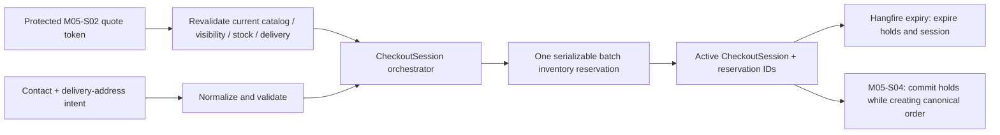

# M05-S03 — Customer Contact, Checkout Session, and Reservation Plan

**Status:** `APPROVED`
**Scope:** Internal checkout-session orchestration, minimal guest/customer contact handling, quote revalidation, and atomic inventory holds.
**Implementation completed and approved by the project owner.**

## 1. Outcome and boundary

M05-S03 converts a valid M05-S02 quote into a short-lived, server-owned `CheckoutSession` with all of its inventory reserved atomically. It adds the smallest customer-contact boundary needed for an eventual order without creating customer accounts, public APIs, payment selection, or orders.

The session is an internal application service only. M05-S05 owns trusted public-store resolution, public request handling, rate limits, and abuse controls; M05-S06 owns storefront UI integration. This step must not add a public controller, use an untrusted tenant header, expose any raw quote token/PII in logs or audit metadata, create an order, commit inventory, configure a payment method, or change existing storefront fixture UI.

## 2. Locked decisions for approval

| Decision | M05-S03 rule |
|---|---|
| Session owner | `CheckoutSession` is tenant-owned and belongs to the current Store. Store/tenant identity always comes from verified server context, never request input. |
| Customer model | A `Customer` is an optional, non-authenticated contact profile—never a browser account. Guest checkout remains valid with no persisted customer profile; the session retains its contact/address snapshot for M05-S04. |
| Contact | Customer/display name and Nepal mobile phone are required for session creation. Email is optional. Phone normalizes only a local ten-digit mobile number or `+977` equivalent into E.164; email normalizes to lower-case after strict address validation. No SMS/email is sent in this step. |
| Address | The session owns a delivery-address snapshot: recipient name, phone, address lines, district, optional municipality/locality, landmark/instructions, and country `NP`. Address location must exactly match the normalized quote destination. No reusable address book is added. |
| Privacy record | The session records a server-derived privacy-policy fingerprint and acknowledgement timestamp, plus a configurable PII review/retention timestamp. This is operational metadata, not a legal compliance claim or marketing-consent feature. Customer PII is never placed in audit metadata, idempotency fingerprints, correlation logs, queue payloads, or problem details. |
| Quote conversion | The quote token is unprotected and then recalculated from canonical Catalog, Store publication, Inventory availability, and active delivery rules before any reservation. Expired, altered, unavailable, repriced, or delivery-changed quotes fail with a safe conflict/validation outcome and create no hold. |
| Inventory hold | All variant quantities for one session reserve in **one PostgreSQL serializable transaction**, locking inventory rows in stable order. Either every line is held or none is held; a multi-line checkout can never leave a partial hold. |
| Lifetime | A checkout session and every hold it owns expire together after 10 minutes by default. This may not outlive the validated quote. Typed options bound the duration to 1–30 minutes; the final expiry is the earlier of quote expiry and session duration. |
| Idempotency | A create request has one bounded idempotency key plus a canonical request fingerprint. A same-key retry returns the original session/reservations; a changed payload conflicts. A SHA-256 token fingerprint prevents a second active session from consuming the same quote token under a different key. Raw tokens are never persisted. |
| State model | `Active → Completed | Expired | Cancelled`. M05-S03 creates and expires sessions only. M05-S04 atomically marks `Completed` while committing reservations and creating an Order. Cancellation is a service capability for future recovery; no public cancellation route is added now. |
| Expiry runtime | A tenant-aware Hangfire job expires due checkout sessions and delegates inventory state changes to the Inventory module. It must be idempotent with the existing generic reservation-expiry job and never double-release stock. |
| Payment | No payment method, QR payload, COD state, payment attempt, payment proof, or payment configuration is introduced. |

The public/unauthenticated actor has no Identity user ID. M05-S03 therefore proposes **ADR-007** before implementation: Inventory reservations retain explicit seller/service actor attribution where present but allow a null actor for the verified public-checkout orchestration path. Audit attribution remains null for a guest request and records only non-PII resource facts. This is required to avoid fabricating a seller user ID for a customer hold and to preserve ADR-006’s tenant-safe reservation boundary.

## 3. Data model

### 3.1 Minimal Customer

`Customer` lives in the Customers module and is tenant-owned.

| Field | Rule |
|---|---|
| `Id`, `TenantId` | Server-owned. |
| `DisplayName` | Required, normalized, maximum 160 characters. |
| `Phone`, `NormalizedPhone` | Required Nepal mobile contact; normalized E.164 value is used for lookup. |
| `Email`, `NormalizedEmail` | Optional; normalized lower-case value is used for lookup. |
| `PrivacyAcknowledgedAt`, `PrivacyPolicyFingerprint` | Server-derived acknowledgement evidence; never supplied as trusted browser facts. |
| `RetentionReviewAt` | Typed-policy operational timestamp, not an automated deletion/legal guarantee. |
| `LastCheckoutAt` | Server-owned operational timestamp. |

No password, login, channel identity, segmentation, marketing preference, customer-facing API, reusable address, merge workflow, or customer search UI is added. Lookup rules are deterministic:

1. No persisted customer is created for a guest session unless the request explicitly opts into saving contact details.
2. When saving, matching normalized phone/email must resolve to zero or one identical Customer. If phone and email point at different profiles, fail safely; do not auto-merge identities.
3. PostgreSQL partial unique indexes protect non-null normalized phone and email per tenant.

### 3.2 CheckoutSession and immutable in-session snapshots

`CheckoutSession` is the Storefront aggregate root. It stores only the facts M05-S04 needs to validate and turn into an Order.

| Field | Rule |
|---|---|
| `Id`, `TenantId`, `StoreId`, optional `CustomerId` | Server-owned and tenant-verified. |
| `QuoteTokenFingerprint` | SHA-256 of the opaque token; never the token itself. One active session per Store/token fingerprint. |
| `QuoteExpiresAt`, `ExpiresAt` | Server-derived; session cannot outlive quote. |
| Contact/address snapshot | Bounded normalized PII snapshot; includes only the checkout contact and Nepal address facts. |
| Quote snapshot | Server-generated product/variant IDs, labels, quantities, canonical unit prices, line subtotals, delivery-rule facts, COD eligibility, and all NPR totals. Browser totals are not stored or accepted. |
| `CheckoutSessionItem` | One immutable snapshot per unique variant with its matching `InventoryReservationId`. |
| `State`, terminal timestamps | Server transition only. |
| `PiiReviewAt` | Operational retention metadata. |

Add `checkout_sessions`, `checkout_session_items`, and an append-only `checkout_session_commands` idempotency table through one forward-only migration. Required indexes/constraints include:

- tenant/store active-session lookup and due-expiry index;
- same-tenant foreign keys to Store, optional Customer, ProductVariant, DeliveryRule, and InventoryReservation;
- unique `(tenant_id, session_id, variant_id)` item identity;
- partial unique `(tenant_id, store_id, quote_token_fingerprint)` while session state is `Active`;
- unique `(tenant_id, operation, idempotency_key)` for command replay;
- immutable session items after create; terminal-state check constraints; `xmin` on mutable session state only.

### 3.3 Inventory adaptation

M04-S03’s existing single-variant `IInventoryService.ReserveStockAsync` remains intact for seller/manual/conversation operations. M05-S03 adds a narrowly scoped Inventory application contract for Storefront orchestration:

- reserve a **batch** of distinct variant quantities for a supplied checkout-session ID and exact expiry;
- lock all tenant inventory rows in stable order inside the caller’s serializable transaction;
- expire due holds before availability is checked;
- create one `InventoryReservation` per line, all with source `Checkout` and the session ID reference;
- provide idempotent session release/expiry and later session commit primitives; and
- return only typed reservation/balance facts, never DbContext access.

The Storefront checkout orchestrator is the explicit cross-module application transaction allowed by ADR-001. It opens the serializable transaction, asks the Inventory contract to lock/allocate the batch, persists the session snapshots and idempotency command, writes privacy-safe audit events, and commits once. Retry handling follows ADR-006’s bounded serialization/deadlock behavior.

## 4. Application services and flow

### 4.1 Contracts

- `ICustomerCheckoutService` (Customers): normalize contact, resolve/create an optional saved Customer, and return safe contact facts. It has no HTTP controller in this step.
- `IStorefrontQuoteService`: add an internal checkout revalidation method. It unprotects the token, confirms its Store/tenant scope and expiry, requotes current server facts, and reports a typed stale/changed/invalid outcome without exposing token internals.
- `IStorefrontCheckoutSessionService`: create/get internal checkout sessions, expire due sessions, and expose a later M05-S04 consume operation contract. It is not a public API contract yet.
- `ICheckoutInventoryReservationService` (Inventory): batch reserve/expire/release/commit session holds within the caller-owned transaction boundary.

Controllers stay absent. M05-S05 will introduce a public façade only after trusted Store host/slug resolution, readiness checks, body limits, rate limits, and anti-automation policy are approved.

### 4.2 Create flow

1. The trusted caller has already established a verified Store/Tenant context. Validate idempotency key, contact, address, and bounded request shape.
2. Hash the opaque quote token for duplicate-active-session protection. Do not persist/log the token.
3. Revalidate the quote against current published variant, visible Store publication, current price, stock availability, active delivery rule, and normalized address location. Require exact Store/Tenant and destination agreement.
4. Resolve or create an optional saved Customer using normalized contact facts; no auto-merge occurs.
5. Start a serializable transaction. Replay a matching session command before allocating. Lock/expire all required Inventory rows in a stable order, prove availability, and create all holds with one shared expiry.
6. Persist the session, immutable items, reservation links, command record, and an audit event containing only session/reservation IDs, counts, and state. Commit once.
7. Return server-generated session/expiry/quote snapshot. M05-S04—not this step—will consume it into an Order and commit its reservations.

### 4.3 Expiry and recovery

`CheckoutSessionExpiryJob` uses the existing tenant-job runner and Hangfire PostgreSQL storage. For every active tenant it processes a bounded due-session batch in deterministic order. It locks the session and associated reservation rows, treats reservations already expired by the generic M04 job as a harmless replay, otherwise expires the batch through Inventory, marks the session `Expired`, and records non-PII audit facts.

There is no new `BackgroundService`, timer, Redis dependency, or process-local schedule. A repeated job, retry, or collision with `InventoryReservationExpiryJob` must not duplicate terminal state, audit rows, or stock release.

## 5. Security, privacy, and compatibility

- Tenant filters and verified context scope every Customer, session, snapshot, reservation, query, command, job envelope, and audit event. A foreign session/customer/quote result is indistinguishable from not found.
- Customer contact, address, quote token, idempotency key, and policy fingerprint are excluded from logs, audit metadata, problem details, and generated public contracts.
- Browser-supplied product IDs, quantities, prices, delivery fees, totals, Store/Tenant IDs, and session expiry are never trusted. Quote revalidation and Inventory allocation decide all authoritative facts.
- Existing seller inventory endpoints continue to require `inventory.write`; internal checkout reservation is reachable only through the Storefront orchestration contract, not a relaxed seller endpoint.
- The existing M05-S02 seller delivery API and M04 reservation behavior remain compatible. Existing test containers, project Docker containers, and migrations are preserved.

## 6. Verification matrix

| Area | Required proof |
|---|---|
| Customer/contact | Nepal phone/email normalization, bounds, optional guest mode, saved-profile lookup, conflicting phone/email identities, and tenant isolation. |
| Privacy | No contact/address/token/idempotency value appears in audit metadata, logs, command fingerprints, or problem detail; session retention metadata is server-derived. |
| Quote boundary | Expired/tampered token, wrong Store/Tenant, destination mismatch, unpublished product, hidden publication, price/delivery change, and insufficient stock fail before holds. |
| Atomic allocation | Multi-line session reserves all lines or none, locks stable order, no negative availability, and concurrent last-unit sessions cannot both succeed. |
| Idempotency | Same request/key replays the same session and reservations; changed payload/key conflicts; an active quote token cannot create a second session under a different key. |
| Lifecycle | Expiry releases every active hold once, generic inventory expiry and session expiry job can race safely, and terminal sessions cannot be consumed/released twice. |
| Tenant/authorization | Foreign customer/session/reservation/quote references cannot leak or mutate; direct seller permission does not become a public checkout bypass. |
| Persistence | PostgreSQL migration, partial/unique constraints, `xmin`, tenant filters, command records, and forwards-only migration apply under Testcontainers. |
| Regression | Full backend suite uses PostgreSQL Testcontainers. No public route, frontend mutation, payment/order object, or fixture migration is introduced. |

## 7. Implementation order

1. Create and accept ADR-007 for guest checkout provenance plus multi-line reservation orchestration; align ADR-006 terminology without weakening its concurrency guarantees.
2. Add Customer/contact normalization and Customer persistence/mapping tests.
3. Add CheckoutSession aggregate, PII-safe snapshots, state/command records, mappings/query filters, and forward-only migration.
4. Extend the quote contract with checkout-specific token revalidation and protected-payload comparison tests.
5. Add the Inventory batch-reservation contract and implementation inside the existing serializable/row-lock conventions; cover contention and all-or-nothing failure.
6. Implement the Storefront checkout-session orchestrator, expiry Hangfire job, tenant-safe audit behavior, and typed RFC 7807-compatible results.
7. Add domain, PostgreSQL Testcontainers, job-race, isolation, idempotency, and no-PII test coverage; run full backend verification and clean disposable test containers/images afterward.
8. Update generated contracts only if an internal contract becomes externally documented; do not wire frontend adapters. Create M05-S03 checkpoint and stop for review.

## 8. Explicitly deferred

- Public Store resolution, public checkout/session endpoints, rate limits, anti-automation controls, cache headers, and host/slug tests (M05-S05).
- Public storefront/cart/checkout UI wiring, loading/error/retry states, and mock-adapter replacement (M05-S06).
- Order, OrderItem, immutable order snapshots, payment state, COD/QR selection, payment proof, and reservation commit-to-order transaction (M05-S04 and M06).
- Customer authentication, account portals, address book, channel identity, contact merging, marketing consent, messaging, deletion policy, and customer search UI.
- Carrier integrations, geocoding, tax/legal calculations, promotions, discounts, and any live payment provider.

## 9. Approval checklist

- Confirm that this step stays internal: no public controller or frontend wiring before M05-S05/M05-S06.
- Confirm required Nepal mobile contact, optional email, guest checkout default, and no customer account/address book.
- Confirm policy-fingerprint/acknowledgement and retention-review metadata are sufficient for this engineering step without asserting legal policy.
- Confirm quote revalidation precedes a single atomic multi-line hold.
- Confirm 10-minute co-expiry, token-fingerprint duplicate protection, and the proposed session state model.
- Confirm ADR-007 is appropriate for null guest actor provenance and the caller-owned cross-module allocation transaction.
