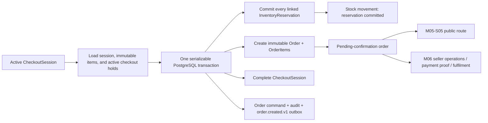

# M05-S04 — Canonical Order Aggregate and Transactional Creation Plan

**Status:** `REVIEW`
**Scope:** Convert one active M05-S03 checkout session into one immutable canonical order, commit its stock reservations atomically, initialize independent order/payment/fulfilment state, and write durable audit/outbox facts.
**Implementation is complete and ready for project-owner review.**

## 1. Outcome and boundary

M05-S04 creates the durable business record that M05-S03 intentionally deferred. The browser will still have no order endpoint at the end of this step. An internal application service, called only under a verified tenant context, converts an active checkout session into one order.



This is intentionally an **internal orchestration step**. It must not add a public controller, host/slug resolution, rate limits, cart UI, seller order pages, QR images/instructions, payment proof upload, a payment gateway, fulfilment/cancellation actions, notifications, or a generated TypeScript client. Those boundaries remain owned by M05-S05, M05-S06, and M06.

## 2. Locked decisions proposed for approval

| Decision | Proposed rule |
|---|---|
| Source of truth | The only creation input is `CheckoutSessionId`, a payment-method selection, and an idempotency key. The order reads all customer, address, item, delivery, fee, and total fields from the active session; request input cannot set product IDs, quantities, prices, totals, Store/Tenant IDs, statuses, or expiry. |
| Session-to-order cardinality | One `CheckoutSession` creates at most one order. A unique tenant/session constraint plus idempotency command replay prevents duplicates under retry or concurrent callers. |
| Snapshot permanence | `Order` and `OrderItem` copy the session’s current snapshots and expose no mutator for items, customer/contact/address, delivery facts, financial facts, or selected method. Later catalog, inventory, delivery, customer, and Store changes never rewrite them. |
| Initial state | `OrderStatus = PendingConfirmation`, `FulfilmentStatus = Unfulfilled`. This preserves the M06 seller-confirmation workflow while making the order durable. |
| Initial payment state | `CashOnDelivery` starts `PaymentStatus = Pending`; `MerchantQr` starts `PaymentStatus = AwaitingVerification`. This step stores only the selected method/state—no merchant QR configuration, instructions, proof, verification, collection, gateway request, or paid state. |
| COD eligibility | COD creation requires the immutable checkout-session `CodAvailable` snapshot. It cannot be re-enabled by request input. |
| Merchant QR boundary | The internal enum/state may be initialized now, but M05-S05 must not expose merchant-QR checkout until M06 payment configuration establishes merchant instructions and availability. This avoids inventing a merchant QR payload. |
| Stock effect | Every active checkout reservation is committed while the order is created. `OnHandQuantity` decreases and `ReservedQuantity` decreases through Inventory-owned movement logic. Once committed, a later M06 cancellation requires an explicit restock/compensating movement policy; it must not silently "release" stock. |
| Expiry | Session, reservation, and order conversion use the same transaction/locks. A session or reservation at/after expiry fails without an order. Session expiry and generic reservation expiry racing the conversion produce one terminal outcome only. |
| System provenance | Guest-originated order creation must never impersonate a seller. M05-S04 introduces explicit system-commerce provenance for the order-created audit event and reservation-commit stock movements: actor kind is `CommerceSystem`, with no `ActorUserId`. Existing member/support audit records retain their current actor identity. This requires ADR-008 and a forward-only schema/contract migration; a magic or fabricated user ID is prohibited. |
| Order reference | The public/seller-friendly order reference is derived from the generated order ID (`ORD-<ID>`), unique without a tenant sequence or a guessable counter. The internal ULID remains the primary key. |
| Outbox | The same transaction writes `order.created.v1` containing only order/session IDs, Store ID, method, and state facts. No contact, address, quote token, idempotency key, or financial/PII payload is placed in the outbox. |

## 3. Domain and persistence design

### 3.1 New aggregates

`Kreyora.Domain/Orders` gains:

- `Order`, tenant/store owned, with `CheckoutSessionId`, optional `CustomerId`, source `Storefront`, safe public reference, payment method, independent order/payment/fulfilment states, creation timestamp, and immutable customer/contact/address, delivery-rule, and financial snapshots.
- `OrderItem`, one per checkout-session item, with immutable product/variant IDs, title/name, quantity, unit price, and subtotal. SKU/version are copied only if they exist on the checkout snapshot; this step must not reread current Catalog data to fill an order item.
- `OrderStatus`, `PaymentStatus`, `FulfilmentStatus`, `OrderSource`, and `OrderPaymentMethod` enums with only approved initial states/transitions. Operational state transition methods stay deferred to M06.
- `OrderCommand`, an append-only persistence command record for `order.create` idempotency. It stores a hash of non-PII command facts, never raw request input.

`CheckoutSession` gains `Complete(now)`, valid only from `Active` before its expiry. It records `CompletedAt` and remains an immutable source snapshot. Its terminal-state database check constraint is extended accordingly.

### 3.2 Provenance amendment (ADR-008)

M05-S03 correctly made checkout reservation actors nullable. M05-S04 must finish that model for guest-safe commitment:

- Add a small shared actor-origin enum (`Member`, `CommerceSystem`) to `AuditEvent` and `StockMovement`. Support reads retain their existing effective-support identity rather than becoming a separate commerce actor kind.
- Make their user actor nullable only for `CommerceSystem`; preserve non-null member/support identities for existing actions.
- Enforce valid actor-kind/user combinations in the domain and PostgreSQL constraints where practical.
- Update audit application contracts and seller-facing reads only as needed to represent the system origin without exposing a fake user. No order UI is added.

`ADR-008-commerce-system-provenance.md` will be created and accepted before this implementation. It locks this replacement for fabricated guest actors and documents its reporting implications.

### 3.3 EF Core schema

The forward-only migration adds `orders`, `order_items`, and `order_commands`, plus the required checkout-session completion and provenance changes. It includes:

- tenant query filters and composite tenant foreign keys to Store, optional Customer, CheckoutSession, DeliveryRule, and InventoryReservation links;
- `xmin` concurrency token on `orders`;
- unique `(tenant_id, checkout_session_id)` and unique `(tenant_id, order_number)`;
- unique `(tenant_id, order_id, variant_id)` on items;
- unique `(tenant_id, operation, idempotency_key)` on commands;
- numeric NPR amounts and a currency check/bound;
- initial-state/terminal-timestamp checks for Order and CheckoutSession;
- no cascade path that can remove historical orders, items, or snapshots when catalog/customer/delivery records change.

## 4. Application and transaction design

### 4.1 Contracts

Add an internal `IOrderCreationService`:

```csharp
Task<Result<OrderCreationResult>> CreateFromCheckoutAsync(
    CreateOrderFromCheckoutRequest request,
    CancellationToken cancellationToken = default);
```

`CreateOrderFromCheckoutRequest` contains only `CheckoutSessionId`, `OrderPaymentMethod`, and `IdempotencyKey`. `OrderCreationResult` contains IDs/reference, immutable state/totals/method/expiry-free confirmation facts, and `WasReplayed`. It returns the existing typed `Result` error model; no controller or public DTO is added.

Extend the internal Inventory boundary with a batch `CommitForOrderAsync` method. It receives an order ID plus the expected checkout reservation/item links and executes inside the caller-owned transaction. It is not a seller-facing `IInventoryService` method and does not relax seller permissions.

### 4.2 Creation flow

1. Require a verified current tenant and validate bounded ID/method/idempotency input.
2. Start one PostgreSQL `Serializable` transaction and look up matching `OrderCommand` first. Same fingerprint replays the original order; a changed command with the same key returns conflict.
3. Lock/load the session, session items, and checkout reservations under the current tenant. Reject missing, foreign, terminal, expired, incomplete, duplicate, mismatched, or non-active reservation state without leaking cross-tenant data.
4. Enforce payment choice: COD requires `session.CodAvailable`; QR may initialize its internal state but contains no fake configuration payload.
5. Create the immutable `Order` and all `OrderItem` snapshots from the session. Do not reprice/requote or consult mutable Catalog data.
6. Call Inventory’s stable-order batch commit. It locks the underlying inventory rows, validates reservation/session/order link equivalence, checks active/not expired state, commits every reservation, and creates `ReservationCommitted` movements with `CommerceSystem` provenance. Any failure rolls back the entire transaction.
7. Mark the session completed, add the idempotency command, audit event, and a minimal `order.created.v1` outbox message. Save and commit exactly once.
8. Return the server-created result. A failed attempt clears tracked state before returning; bounded serialization-conflict retry follows the proven M04 reservation conventions.

## 5. Security, privacy, and correctness rules

- Tenant context is verified before every query/write; a foreign session/order/customer/reservation is not distinguishable from absent data.
- PII remains solely in order/session snapshots. It is excluded from idempotency fingerprints, problem details, audit metadata, logs, and outbox content.
- The request cannot mutate checkout/order facts or pick a payment status. `Paid`, merchant proof, COD collection, refunds, cancellation, confirmation, dispatch, and delivery remain impossible in this step.
- The transaction must handle checkout-expiry and generic-reservation-expiry races without duplicate movements, duplicate audit/outbox rows, or stock drift.
- Existing manual/conversation reservations and seller inventory endpoints retain their actor/authorization behavior. The new system provenance applies only to the trusted internal commerce conversion path.
- No public order API is introduced. The existing seller audit and inventory-read schemas gain nullable `actorUserId` plus `actorKind` so they can represent automated order creation; their checked-in OpenAPI snapshot and generated TypeScript contract are refreshed from the live local API.

## 6. Verification matrix

| Area | Required proof |
|---|---|
| Domain | Initial state combinations, invalid method/state rejection, immutable snapshots, session completion, unique item shape, and system-versus-member actor provenance. |
| Canonical snapshot | Editing Catalog price/title/variant, delivery rules, Store policy, or saved Customer after creation does not alter the Order. |
| Financial integrity | Order amounts, delivery facts, line totals, and currency exactly equal the completed session; browser values are absent from input. |
| Inventory | Every linked reservation becomes committed, on-hand/reserved balances reconcile, one committed movement exists per line, and a failure leaves no order/movement/terminal session. |
| Idempotency | Same key/facts returns the same order; changed facts/key conflicts; different keys cannot convert the same session twice. |
| Races | PostgreSQL/Testcontainers tests race expiry against creation and two creation attempts against one session; exactly one terminal/stock outcome wins. |
| Payment boundary | COD rejects a session without COD eligibility; QR starts only `AwaitingVerification`; no path marks payment paid or attaches proof/configuration. |
| Tenant/privacy | Cross-tenant IDs leak nothing; audit/outbox/idempotency metadata excludes customer/address/token/key and records `CommerceSystem` rather than a fictitious seller. |
| Persistence | Fresh PostgreSQL migration apply, query filters, foreign keys, `xmin`, append-only command behavior, and no destructive cascade path. |
| Regression | Full backend build, architecture/unit/contract/integration tests run with Testcontainers; disposable test containers/images are cleaned without touching project Docker resources. |

## 7. Implementation order

1. Create and accept ADR-008 for explicit commerce-system provenance.
2. Add Order domain aggregates/enums plus CheckoutSession completion and exhaustive domain tests.
3. Add provenance-safe AuditEvent/StockMovement amendment, mappings, migration, and compatibility tests.
4. Add order persistence configuration, tenant filters, command record, schema migration, and PostgreSQL migration test.
5. Add internal order creation and Inventory batch-commit contracts/implementations using the shared serializable transaction convention.
6. Add audit/outbox creation facts and idempotent replay behavior.
7. Add focused and full PostgreSQL/Testcontainers tests for snapshot immutability, failure atomicity, expiry/concurrent-create races, tenant isolation, COD/QR state initialization, provenance, and PII safety.
8. Update `CURRENT_WORK`, checkpoint, and documentation for review. Do not refresh Graphify until the project owner approves the completed step.

## 8. Explicitly deferred

- Public `POST` order/session conversion route, host/slug resolution, trusted storefront context, rate limiting, anti-automation, cache policy, and public error contract (M05-S05).
- Storefront cart/checkout/confirmation UI, generated client usage, and seller order UI (M05-S06 and M06).
- Merchant QR configuration/instructions/image, proof upload, payment attempt, manual verification, COD collection, gateways, refunds, and payment notifications (M06).
- Seller confirmation/cancellation, fulfilment transitions, restock/compensation policy, order timeline/activity UI, and notifications (M06).
- Customer accounts, address books, promotions, tax calculation, live provider integrations, and custom domains.

## 9. Approval checklist

- Confirm the internal-only boundary and no public/frontend work in this step.
- Confirm `PendingConfirmation` / `Pending` / `Unfulfilled` for COD and `PendingConfirmation` / `AwaitingVerification` / `Unfulfilled` for internal merchant QR selection.
- Confirm that stock commits at canonical order creation and later cancellation uses an explicit M06 compensating policy rather than releasing committed stock.
- Confirm explicit `CommerceSystem` provenance and reject any magic seller/user actor ID.
- Confirm immutable session-derived snapshots, one-order-per-session, serializable transaction, idempotency, and minimal non-PII outbox payload.
- Confirm QR configuration/proof and all operational transitions remain deferred.
