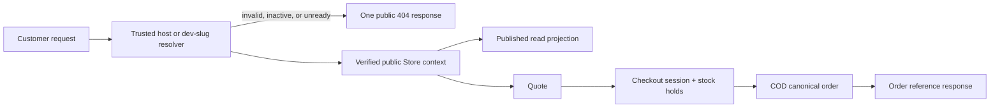

# M05-S05 — Public Storefront API, Resolution, and Abuse-Control Plan

**Status:** `REVIEW`
**Scope:** Add the anonymous, server-authoritative HTTP boundary for active platform stores: trusted production host resolution, development-slug routing, published storefront reads, public quote/session/COD-order writes, bounded public media delivery, and abuse controls.

## 1. Outcome and non-goals

M05-S05 makes the completed M05 commerce services reachable by a customer without granting them seller identity or tenant-selection power. It deliberately creates an API boundary only; M05-S06 will replace the storefront fixture adapters and build the customer journey UI.

Out of scope: Next.js/storefront UI wiring, cart persistence, merchant QR configuration/instructions/proof, payment verification, seller order screens, fulfilment/cancellation, notifications, custom domains, CDN/object-public ACLs, CAPTCHA/provider integration, Redis, and M06 work.

## 2. Accepted ADR-009 decisions

1. A public request resolves one Store only from `slug.platformBaseDomain` in production, or the explicitly development-only `/public/v1/dev/stores/{slug}` route. No header, query parameter, request body, or cookie may select a tenant.
2. A dedicated public Store context carries verified tenant/store identity without a user/membership/role. It is distinct from seller authorization and is opened only after the resolver finds an active, purchase-ready Store.
3. Production trusts forwarded host data only after configured proxy trust. Direct client `X-Forwarded-Host`, IPv4/IPv6 literals, apex hosts, extra subdomain labels, and nonmatching base domains fail closed.
4. Public not-found behavior is deliberately uniform for missing, inactive, unready, malformed, and foreign store selections. Tenant IDs and readiness reasons never cross the boundary.
5. Merchant QR stays internal-only in this step. Public canonical-order creation is COD-only because no real merchant configuration exists; the client cannot select a payment state.

## 3. Public contract

All routes are versioned below `/public/v1`. Production routes are host-bound (`/store/...`); development/test routes have the `/dev/stores/{slug}` prefix and map to the same controller action/service call.

| Operation | Route shape | Cache | Rules |
|---|---|---|---|
| Store profile | `GET /store` | public, short bounded TTL + ETag | Safe brand/contact/social/policy fields only; no IDs, readiness details, tenant fields, or seller configuration. |
| Product page | `GET /store/products/{productSlug}` | public, short bounded TTL + ETag | Active Store, visible publication, published purchasable Product/Variant only. Missing/unpublished/foreign is public 404. |
| Product listing | `GET /store/products?cursor=&pageSize=&q=` | public, short bounded TTL + ETag | Cursor pagination, `pageSize` 1–50, bounded normalized search (max 64 chars), stable opaque cursor; no total count. |
| Public media | `GET /store/media/{mediaId}` | public bounded cache | Ready asset attached to a product visible in the resolved Store; stream through application/storage boundary, no bucket URL, object key, original name, tenant, or cross-store asset access. |
| Quote | `POST /store/checkout/quotes` | `no-store` | Lines/destination only, max 50 lines; quote service calculates all commerce facts. |
| Checkout session | `POST /store/checkout/sessions` | `no-store` | Quote token, customer/contact/address, privacy acknowledgement; `Idempotency-Key` header is required and mapped to the existing bounded session request. |
| COD order | `POST /store/checkout/orders` | `no-store` | Checkout-session ID plus `Idempotency-Key`; controller always selects COD and invokes internal order creation. Response exposes confirmation reference/state/totals, never tenant/store/customer/address snapshots. |

Development forms add `/dev/stores/{slug}` after `/public/v1`; those paths are disabled outside Development/Testing. The generated OpenAPI snapshot describes both surfaces. M05-S06 uses the generated contract, never hard-codes private/seller routes.

### Public response and error rules

- Read responses must not include `TenantId`, `StoreId`, customer data, internal statuses, inventory balances, raw storage keys, quote internals, or seller audit fields. Opaque product/variant/session IDs are returned only where a following public request needs them.
- `404` has one generic storefront-unavailable problem for store/product/media selection. `400` covers bounded malformed input; `409` covers stale quote, expired/session-terminal state, and idempotency misuse without disclosing another store; `429` includes `Retry-After` and correlation ID.
- Controllers use the existing RFC 7807/global-exception/correlation convention. Public model validation is explicit; no seller `RequireTenantContext`, authorization policy, or tenant header applies.
- Existing guest checkout audit writes that currently have no member actor are corrected to `CommerceSystem` provenance before exposure. Public metadata and outbox records remain PII-safe.

## 4. Backend design

### 4.1 Resolution and context

Add `PublicStorefrontOptions` with validated `PlatformBaseDomain`, development-route switch, trusted proxy configuration, public cache TTLs, request-size limit, and named rate-limit settings. Production startup rejects an empty/invalid base domain or an enabled development route.

Add endpoint metadata (`RequirePublicStorefrontContext`) and `PublicStorefrontContextMiddleware`:

1. Detect marked anonymous endpoint.
2. Resolve the normalized slug from the production host or sanctioned development route—not headers/body/query.
3. Perform a minimal global Store lookup with `IgnoreQueryFilters`, exact normalized slug, `Active` state, and read-only readiness test. It must return a single verified Store/Tenant tuple or the uniform public 404.
4. Begin a scoped, no-user tenant context for the marked endpoint and expose a dedicated read-only `IPublicStorefrontContextAccessor` to controllers/services.
5. Clear the scope after the response. No middleware can promote this scope to seller membership or support access.

Dedicated public projection services query tenant-filtered rows plus the resolved Store/publication predicates. They do not call seller administration, inventory, media, audit, or tenant membership services directly. Quote/session/order calls reuse their existing application contracts after the context is established; only thin input/output adapters are added.

### 4.2 Reads and media

Add a public Store projection and product/listing projection. They expose stable customer-safe fields and include only visible Store publications, published products, sellable variants, and approved product media metadata. Use a stable cursor based on normalized title/slug plus ID; validate/decode it defensively and treat malformed cursors as a generic validation error.

Add a narrow public-media read service rather than making the storage bucket public. It verifies ready/attached media → visible product → resolved active Store before opening the object. Success receives content type and bounded cache headers; failure is the same public 404. Response headers include `X-Content-Type-Options: nosniff` and do not allow content disposition to be controlled by stored filenames.

### 4.3 Writes, state, and idempotency

- Quote: controller maps the public DTO to `StorefrontQuoteRequest`; Store, product publication, price, available stock, delivery rule, fees, currency, and expiry remain server-owned.
- Session: controller requires an `Idempotency-Key` header (1–256 printable bounded characters) and maps it to `CreateCheckoutSessionRequest`. It does not accept Tenant/Store IDs, reservation IDs, totals, prices, payment status, expiry, or a Customer ID.
- Order: controller requires the same bounded header and a session ID. It maps to `CreateOrderFromCheckoutRequest(sessionId, CashOnDelivery, key)`. QR is not accepted/exposed. The internal service retains its serializable transaction, session/hold linkage, command replay, stock commit, immutable snapshots, audit, and minimal outbox fact.
- Replays return the prior safe public result. A changed command fingerprint returns privacy-safe `409`; a foreign/unavailable session is indistinguishable from unavailable under the current resolved Store.

### 4.4 Abuse, request, cache, and CORS controls

Register named partitioned rate-limit policies keyed by `remote IP + normalized Store slug + endpoint family`; use the resolved Store context, never customer contact, token, or untrusted header. Proposed initial limits are configurable and test-overridable: reads 120/minute, quote 20/10 minutes, session 10/10 minutes, order 5/hour. Rejections are problem details with `429`, correlation ID, and `Retry-After`.

Set a public JSON body limit (16 KiB) for quote/session/order endpoints before model binding. Keep domain limits (50 lines, quantity bounds, field lengths) as a second layer. Do not introduce a CAPTCHA, fingerprinting, public session cookie, or Redis dependency.

Reads get explicit `Cache-Control`, ETag, and `Vary: Host` (and the development route identity where appropriate); quotes, sessions, orders, errors containing business state, and media authorization failures are `Cache-Control: no-store`. Do not cache by tenant header. Public CORS uses configured allowed frontend origins with no wildcard credentials; M05-S06 supplies the browser client. Same-origin host calls remain valid.

## 5. Persistence, contracts, and configuration

No new commerce aggregate/table is required. This step adds validated public-host/rate/cache configuration and may add non-sensitive public media projection DTOs only. Existing M05-S04 migration remains unchanged unless EF mapping reveals a required read-only index; any such additive migration must be justified in the implementation checkpoint.

Generate OpenAPI and TypeScript from a live local API after the public routes are implemented. Add public request/response examples and ensure the generated contract does not contain tenant headers or private DTO fields.

## 6. Verification matrix

| Area | Required proof |
|---|---|
| Resolver | Production host accepts only exact single-label platform subdomains; trusted-proxy behavior, untrusted forwarded host, apex/IP/extra-label/malformed hosts, development route environment gate, inactive/unready/missing store all fail closed and uniformly. |
| Tenant isolation | Forged tenant header/body/query has no effect; store A cannot read product/media or create quote/session/order against Store B. Public context never satisfies seller policies. |
| Reads | Only active-visible-published-sellable data returns; cursor/search bounds, ETag/cache/Vary headers, and no private fields are covered. |
| Media | Attached visible ready asset streams; pending/deleted/unattached/foreign/unpublished media returns uniform 404; no object key/filename/provider URL leaks. |
| Commerce writes | Browser totals/status/store/tenant fields are rejected/ignored; quote/session/order use canonical data; COD availability, quote/session expiry, idempotency replay/mismatch, and reservation/order atomicity retain M05-S03/S04 guarantees. |
| Provenance | Anonymous session/order audit and stock records use `CommerceSystem`; no user impersonation or PII metadata appears. |
| Abuse | Per-store/IP partitions, `429`/Retry-After/correlation shape, request-size limit, and malformed/oversized payload behavior are integration tested with test-only options. |
| Contract | Live OpenAPI snapshot, generated TypeScript contract, public endpoint integration tests, and response-field allowlist tests pass. |
| Regression | Full backend Testcontainers suite, frontend contract/typecheck suite, and disposable-container/image cleanup run before checkpoint. |

## 7. Implementation order

1. Accept ADR-009 and add validated public storefront/proxy/rate/cache options.
2. Add public endpoint metadata, resolver/context middleware, uniform public problem helper, and resolver tests before public controllers.
3. Add public Store/catalog/product/list/media projections and safe cache behavior.
4. Add public quote, session, and COD-order DTO/controller adapters, including guest `CommerceSystem` audit correction.
5. Add request-size, CORS, and named partitioned rate-limit policies; test `429` deterministically with test options.
6. Add host, isolation, enumeration, publication/media, checkout/order replay, expiry, provenance, and contract coverage.
7. Run the live API OpenAPI/TypeScript generation, all required tests, Docker/Testcontainers cleanup, documentation, and M05-S05 review checkpoint. Do not begin M05-S06.

## 8. Approval checklist

- Approve ADR-009’s production host and development-route boundary.
- Approve public COD-only creation until real merchant-QR configuration is delivered in M06.
- Approve the public media stream boundary without public buckets or storage URLs.
- Approve the initial configurable rate limits, 16 KiB write-body cap, cache split, and CORS posture.
- Confirm no frontend/customer journey work starts until M05-S06.
