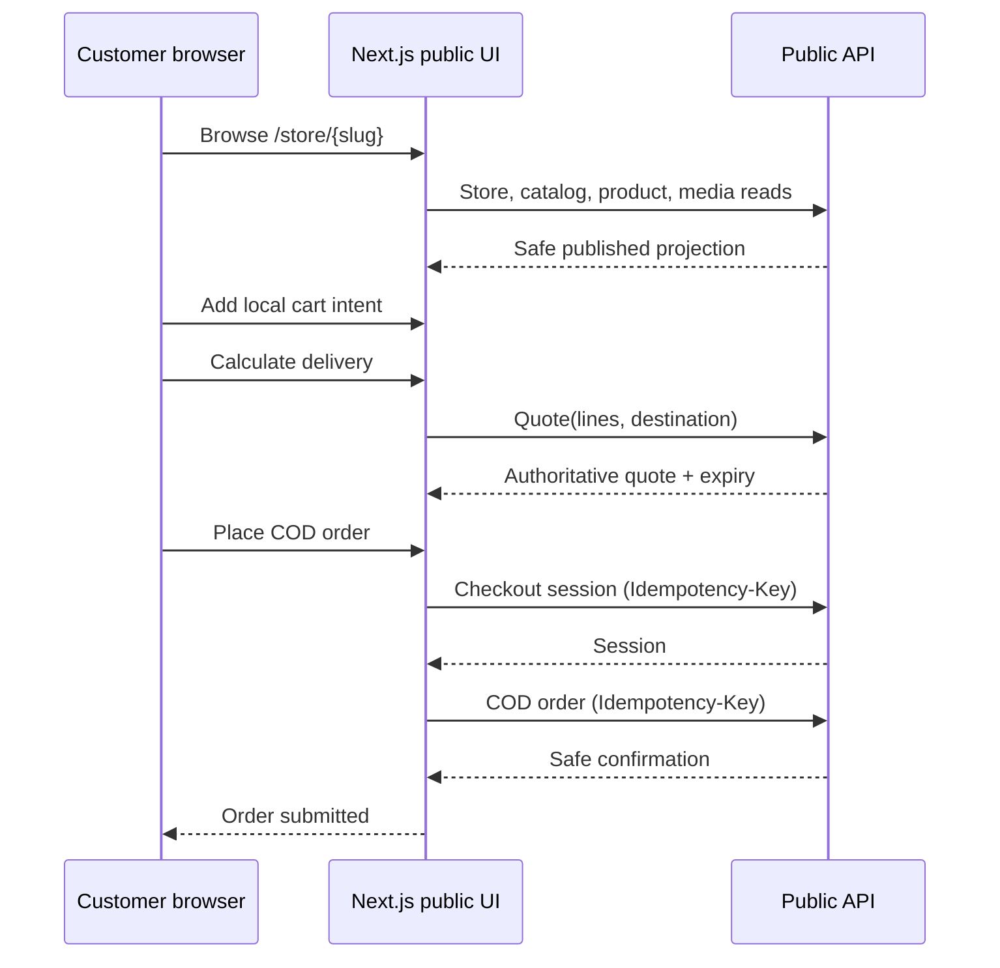

# M05-S06 — Public Storefront Frontend and COD Customer Journey Plan

**Implementation status:** `REVIEW`  
**Plan review:** Implemented; awaiting project-owner review  
**Scope:** Replace the public storefront's fixture-only runtime path with typed adapters over the M05-S05 anonymous public API; deliver the responsive product-to-COD-order journey without moving commerce authority into the browser.

## 1. Outcome and boundaries

When the public API is configured, a customer can open a platform storefront, browse its published products, view permitted public media, keep a store-scoped cart, obtain a server quote, create a checkout session, and submit one COD order. Every displayed checkout total after a quote comes from the server.

Fixture mode remains deliberately available for demos with no `NEXT_PUBLIC_API_URL`, but a configured API must never silently fall back to fixture data after an error. Existing seller/admin ports remain seller-only and are not used by anonymous public routes.



### Explicit non-goals

- Merchant QR configuration, QR instructions/images, proof upload, or payment verification. Accepted ADR-009 makes public checkout COD-only until M06.
- New public backend endpoints, schema/migrations, custom domains, customer accounts, customer notifications, or seller order operations.
- A public order-status lookup API. The current lookup page is a fixture-only demo and must not call a seller `OrderClient` in live mode.
- A browser-calculated delivery fee, total, stock balance, payment state, or any browser-selected tenant/store/payment method.
- Automatic production reverse-proxy/DNS deployment work. The required host-routing contract is recorded below for the deployment step.

## 2. Accepted constraints and conflict record

1. **ADR-009 controls this step.** Production public API requests are bound to the storefront host; local Development/Testing requests use M05-S05's sanctioned `/public/v1/dev/stores/{slug}` routes. No tenant header, cookie, route parameter, or body field selects a tenant.
2. **COD only.** The old M05 prompt requested mobile coverage for merchant-QR-awaiting-verification. That conflicts with ADR-009's accepted payment boundary. The milestone prompt is corrected to COD-only; M06 owns the missing merchant configuration/proof decision and implementation.
3. **M05-S05 generated contract is the boundary.** UI code consumes `apps/web/src/lib/api/generated/v1.ts`; it does not recreate DTOs from seller/admin models or call seller catalog, inventory, storefront, order, or payment endpoints.
4. **The API remains authoritative.** The cart is customer intent only. Quote/session/order outputs, not local calculations or snapshots, decide availability, delivery, COD eligibility, and money.
5. **No false persistence.** The cart may use browser session storage only for non-PII product/variant/quantity intent. It must never store contact/address data, quote tokens, checkout session IDs, idempotency keys, or payment/order details.

## 3. Frontend architecture

### 3.1 Separate public ports and adapters

Add a public storefront port rather than extending the seller-oriented `StorefrontClient` or `CheckoutClient`:

```ts
interface PublicStorefrontClient {
  getStore(slug: string): Promise<PublicStorefront>;
  listProducts(input: PublicCatalogQuery): Promise<PublicCatalogPage>;
  getProduct(slug: string, productSlug: string): Promise<PublicCatalogProduct>;
  getMediaUrl(slug: string, mediaId: string): string;
}

interface PublicCheckoutClient {
  createQuote(input: PublicQuoteIntent): Promise<PublicDeliveryQuote>;
  createSession(input: PublicCheckoutIntent): Promise<PublicCheckoutSession>;
  createCodOrder(input: PublicCodOrderIntent): Promise<PublicOrderConfirmation>;
}
```

The real adapters map generated M05-S05 DTOs into deliberately small public view models. They expose only product/variant IDs needed for a following public request, public names/descriptions/prices/media, server quote facts, and the safe order confirmation. They do not reuse the seller `Store`, `Product`, `Order`, `PaymentMethod`, `DeliveryRule`, or inventory types.

Fixture adapters implement the same public ports and remain behind the existing explicit fixture-mode switch. `ClientSet` gains `publicStorefront` and `publicCheckout`; existing seller port behavior is unchanged. This preserves swappable/testable access and prevents fixture imports from leaking into live public components.

### 3.2 Explicit public request resolution

Add one public-request resolver used only by the real public adapters:

| Runtime | Request path | Why |
|---|---|---|
| Local Development/Testing with `NEXT_PUBLIC_API_URL` | `${NEXT_PUBLIC_API_URL}/public/v1/dev/stores/{slug}/...` | Uses the M05-S05 development-only route while Next.js runs on a separate local origin. |
| Host-bound public deployment | Relative `/public/v1/store/...` | The browser reaches the API through the storefront host, preserving the verified production host-to-store boundary. |
| No configured public API | Fixture adapter only | Visible demo behavior; no claim that the store/order is live. |

This resolver is separate from the seller `apiFetch` base URL. Production infrastructure must proxy `/public/v1/*` on each storefront host to the API while preserving the trusted host/forwarded-host configuration. A browser must not call `api.example` directly for a host-bound store, because that would resolve the API host instead of the customer's storefront host.

### 3.3 Shared HTTP behavior

Extend the shared fetch layer so successful JSON bodies from `201 Created` are parsed; only `204 No Content` returns `undefined`. Preserve correlation IDs and add an optional parsed `Retry-After` value to `ApiClientError`.

The public adapter uses anonymous requests (`credentials: "omit"`) and supplies `Idempotency-Key` for session/order writes. It does not attach seller tenant headers or cookies. An order/session retry reuses the same key for the same unresolved intent; a new key is generated only after a confirmed new intent/quote.

## 4. Route and state changes

### 4.1 Store shell, catalog, and product

- Move public store loading beneath `store/[slug]` so the layout/context resolves that actual slug; remove `DEMO_TENANT_ID` from live public pages.
- Replace local seller-catalog queries with public listing query/search/cursor behavior. Search is debounced or explicitly submitted and cursor pagination is server-driven; the UI does not fabricate a total count.
- Treat the product URL segment as a **product slug**. Rename the dynamic route/links to make this contract clear and update fixture links accordingly.
- Render media only through the public adapter's verified media path. Do not expose storage URLs, keys, or filenames.
- In live mode, remove SKU, exact inventory, seller tags/collections, collection APIs, and seller-only readiness details. The public backend has no collection contract; collection browsing remains visibly demo-only until a later approved public collection surface exists.
- Provide loading, empty, public-unavailable (`404`), retryable error, and success states on every public route. Do not replace an API failure with demo data.

### 4.2 Cart intent

The cart becomes a `storeSlug`-scoped client intent store. It contains only safe public variant ID, title/variant label, current public unit-price snapshot, media reference, and quantity. It is persisted in session storage under a versioned per-store key and is cleared when switching stores or after a confirmed order.

The cart page may show the local line subtotal as an estimate before a quote, labelled accordingly. Delivery and checkout total are shown as “calculated at checkout” until a valid server quote exists. It never reserves stock or claims that its local amount is authoritative.

### 4.3 Checkout state machine

Replace seller delivery-rule/payment-method reads and browser fee calculation with this explicit state flow:

```text
editing address/contact
  -> calculate quote
  -> quote ready (authoritative totals + expiry + COD availability)
  -> creating checkout session (idempotency key A)
  -> creating COD order (idempotency key B)
  -> confirmation
```

- The form captures only the M05-S05 quote/session fields: customer name/phone/optional email, address lines, locality/municipality/district/country, and privacy acknowledgement. Client-side required-field hints improve usability but never replace API validation.
- “Calculate delivery” submits current cart lines and normalized destination. It is explicit, not triggered on every keystroke, to respect public write limits.
- The quote response supplies delivery option/name/ETA, COD eligibility, merchandise subtotal, delivery fee, discount/tax/fee fields, total, currency, and expiry. These values replace local display values.
- There is no delivery-rule radio list, payment-method radio list, merchant QR content, or browser payment selection. If `codAvailable` is false, explain that delivery to this address cannot currently be completed and allow editing/requoting; do not submit an order.
- “Place COD order” is disabled while a write is pending and after a confirmed result. It uses the active quote token to create a session, then uses that returned session ID to create the COD order. It clears cart/quote state only after the safe confirmation response.

### 4.4 Confirmation and lookup

The confirmation route receives a safe `PublicOrderConfirmation` through a short-lived client/session-storage confirmation record keyed by the returned order number. It can render order number, order/payment/fulfilment status, COD label, currency, and server total—never customer/address/item snapshots unavailable from the public result.

On direct navigation or refresh without that safe record, show an honest “Order submitted” reference fallback using the route order number; do not claim a fresh server lookup. The current order-lookup route becomes a visibly fixture-only experience in demo mode and a non-searchable support message in live mode. M06 must design an authenticated or capability-protected status lookup before one is exposed publicly.

## 5. Failure and recovery contract

| Condition | UI response | Customer recovery | Data rule |
|---|---|---|---|
| Validation / malformed input (`400`) | Show field-safe API detail and one accessible toast/summary | Correct the affected input and recalculate | Keep cart; discard unusable quote/session state. |
| Store/product/media unavailable (`404`) | Public unavailable page, not technical tenant detail | Return to storefront | Never reveal whether a product/store is unpublished, foreign, or inactive. |
| Quote/session stale, changed price/stock, idempotency mismatch (`409`) | Explain that price, stock, or delivery changed | Keep cart, invalidate quote/session, calculate a new quote | Never reuse an invalid quote/session. |
| Delivery/COD unavailable | Explain that this destination cannot be completed | Edit destination/cart and recalculate | Do not display another unimplemented payment method. |
| Duplicate tap/request | Pending UI plus stable idempotency key | Wait; retry same unresolved request only | Exactly one session/order intent per key. |
| Rate limit (`429`) | Accessible retry timing using `Retry-After` | Retry after the stated period | Do not rapidly auto-retry. |
| Transient network/5xx | Honest retry state; retain inputs/cart | Retry with same active idempotency key when completion is unknown | Do not create a fresh duplicate intent. |
| Expired local confirmation | Honest reference-only fallback | Contact the store/support; M06 may add secure lookup | Do not render fixture/seller order details. |

All interactive errors use the existing toast pattern plus visible, associated form error text where applicable; focus moves to the first invalid field when it improves keyboard recovery. Loading, empty, success, error, stale/conflict, and reduced-motion behavior must meet the frontend rules.

## 6. Verification plan

### Automated tests

- Unit tests for public URL resolution, generated-contract mapping, public media URL construction, fixture-vs-live adapter selection, `201` JSON parsing, `204` behavior, correlation IDs, `Retry-After`, and idempotency-header reuse.
- Component tests for catalog/product loading/empty/unavailable states, safe public media, no seller inventory/SKU/QR rendering in live mode, cart store scoping/session persistence, and no fixture fallback after live failure.
- Checkout interaction tests covering successful quote/session/COD confirmation; invalid input; changed price/insufficient stock/expired quote or session; unavailable delivery/COD; duplicate submit; `429`; and transient retry. Verify server quote values replace local estimates.
- Add Playwright as the browser E2E runner (the repository currently has no E2E runner). Its mobile viewport scenario uses a seeded Development API and the sanctioned dev-slug route to cover store → product → cart → quote → COD order → confirmation. Add desktop smoke coverage and accessibility/keyboard assertions for the critical form.
- Run `pnpm generate:api` drift verification against the M05-S05 live API contract, then frontend lint, typecheck, unit/component tests, production build, and the new E2E suite. Backend M05-S05 integration/contract coverage remains regression evidence; no fabricated backend change is claimed.

### Manual review

1. Run the local API with an active purchase-ready seeded Store, visible published product, inventory, and COD delivery rule; configure `NEXT_PUBLIC_API_URL` for Development.
2. At 375 px and desktop width, walk browse → add → quote → COD order. Confirm displayed quote/confirmation facts match API responses and no tenant/store/reservation/storage fields appear.
3. Change a product price/stock or expire the quote/session and confirm the cart is retained, stale data is invalidated, and re-quote is required.
4. Inspect browser traffic: live public calls use only `/public/v1/dev/stores/{slug}` locally or host-relative `/public/v1/store` in production; no seller endpoint or tenant header is used.
5. Confirm live-mode order lookup does not expose fixture customer/address/order details, and merchant QR is not shown.

## 7. Implementation order

1. Add public view models, typed ports, fixture adapters, real generated-contract adapters, and explicit local/host-bound public request resolver.
2. Correct shared `201` JSON/`Retry-After` handling with regression tests.
3. Refactor the public store shell/catalog/product/cart routes to use only public ports and store-scoped intent.
4. Replace checkout with the authoritative quote → session → COD-order state machine and recovery behavior.
5. Replace confirmation/lookup seller-data access with safe confirmation state and honest live fallback.
6. Add component, contract-drift, mobile E2E, accessibility, and manual verification evidence; update the M05-S06 checkpoint. Do not start M05-S07 until review approval.

## 8. Approval checklist

- Approve the separate public ports/adapters and no-fallback live behavior.
- Approve session-storage cart intent limited to non-PII, non-authoritative data.
- Approve the public host-routing requirement for production and dev-slug-only behavior locally.
- Approve COD-only scope; merchant QR and secure order lookup remain M06 work.
- Approve introducing Playwright for mobile/desktop customer-journey coverage.
