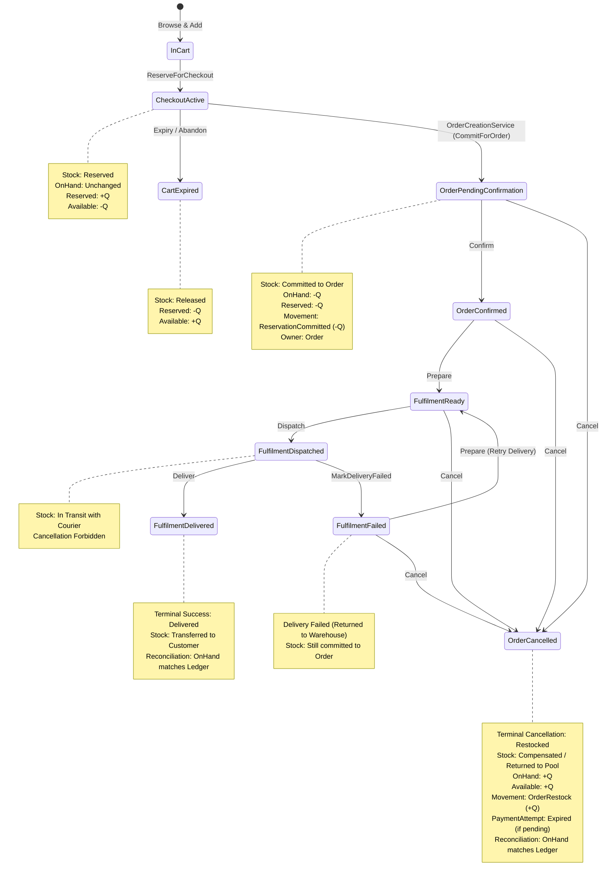

# M06-S03: Inventory Allocation, Cancellation, and Fulfilment Coordination Plan

## 1. Overview & Objectives

- **Milestone:** 06 — Order Operations, Manual Payments, Fulfilment, and Notifications
- **Step:** 03 — Inventory allocation, cancellation, and fulfilment coordination
- **Phase:** Phase 1 (Architect) Design & Planning
- **Governing Reference:** `docs/milestones/06_ORDER_OPERATIONS_PAYMENTS_NOTIFICATIONS.md` (Prompt 03)
- **Architecture Invariants:** ADR-001 (Service layer, no MediatR/CQRS), ADR-006 (Inventory reservation consistency and Hangfire expiry), ADR-007 (Checkout-session reservation orchestration), `docs/plan/plan.md` §§10.3–10.5.

### Core Objective

Deliver robust, transactional application orchestration across all order lifecycle events and operational actions:
1. Order confirmation, preparation, dispatch, delivery, delivery failure, payment verification effects, COD collection, and order cancellation.
2. Define the exact **stock ownership timeline** and enforce atomic stock commitment, deduction, and cancellation restock compensation.
3. Enforce single-transaction consistency within bounded PostgreSQL serializable boundaries, maintaining ledger-to-balance equality across every terminal path.
4. Provide safe concurrency handling (optimistic `xmin` checks and PostgreSQL serialization retry) between simultaneous operational actions (e.g. concurrent Cancel vs. Dispatch).
5. Ensure idempotent action replay via `OrderCommand` and idempotent stock restock movements via unique constraints.
6. Populate provider-neutral outbox events (`OutboxMessage`) for order and fulfilment state changes to feed the Step 04 notification pipeline.

---

## 2. Permitted and Prohibited Scope

### Permitted Scope
- Extend `StockMovementType` enum with `OrderRestock`.
- Extend `PaymentAttempt` domain entity with `Expire(DateTimeOffset now)` method to invalidate pending/unverified attempts upon order cancellation.
- Extend `IOrderInventoryReservationService` in `Kreyora.Application.Inventory` with `RestockForOrderAsync` contract and DTOs (`OrderInventoryRestockRequest`, `OrderInventoryRestockLine`, `OrderInventoryRestock`).
- Implement `RestockForOrderAsync` in `InventoryService` with row-level locks (`SELECT ... FOR UPDATE`), ledger balance update, and immutable `StockMovement` creation.
- Update `OrderOperationService` to:
  - Inject `IOrderInventoryReservationService`.
  - Include `order.Items` in order queries.
  - Coordinate atomic stock restock and payment attempt expiration on `OrderAction.Cancel`.
  - Record appropriate `OutboxMessage` records across all successful operational transitions (`order.confirmed.v1`, `order.cancelled.v1`, `order.prepared.v1`, `order.dispatched.v1`, `order.delivered.v1`, `order.delivery_failed.v1`, etc.).
- Add unit tests for domain additions (`PaymentAttempt.Expire`, enum definitions).
- Add exhaustive real PostgreSQL integration tests (`OrderFulfilmentInventoryCoordinationTests`) verifying:
  - Stock reconciliation across all terminal paths (COD delivery, QR delivery, cancellation from pending, cancellation from confirmed, cancellation from ready, delivery failure then cancel, delivery failure then redelivery, multi-line order cancellation).
  - Concurrency conflicts between cancellation and fulfilment (Cancel vs. Dispatch).
  - Idempotent duplicate command replays with zero double-restock.

### Prohibited Scope
- No MediatR, CQRS, or distributed sagas.
- No direct database repository cross-access between orders and inventory modules; cross-module orchestration must strictly use `IOrderInventoryReservationService`.
- No live payment gateway or external courier integrations.
- No modifications to frontend seller workspace (deferred to M06-S05).
- No implementation of notification outbox workers or delivery adapters (deferred to M06-S04).
- No bypassing tenant isolation or using client-supplied prices/stock states.

---

## 3. Stock Ownership Timeline & Lifecycle Model



### Detailed Stock Ledger Invariants

Across every state transition, the fundamental inventory equation must hold:
$$\text{OnHandQuantity} = \sum \text{StockMovement.QuantityDelta}$$
$$\text{AvailableQuantity} = \text{OnHandQuantity} - \text{ReservedQuantity}$$

1. **Checkout Hold**:
   - `OnHand`: Unchanged
   - `Reserved`: $+Q$
   - `Available`: $-Q$
   - `StockMovement`: None (only `InventoryReservation` record with `State = Active`).
2. **Order Creation (`order.create`)**:
   - `OnHand`: $-Q$
   - `Reserved`: $-Q$
   - `Available`: Unchanged (already reduced by reservation hold)
   - `StockMovement`: Append `StockMovementType.ReservationCommitted` with delta $-Q$.
3. **Order Preparation, Dispatch, Delivery**:
   - Physical stock progresses from packed (`Ready`) to in-transit (`Dispatched`) to delivered (`Delivered`).
   - Ledger balance remains $-Q$. No intermediate movements required; the commitment already deducted on-hand units.
4. **Order Cancellation (`order.cancel`)**:
   - Permitted from: `PendingConfirmation`, `Confirmed`, `Processing` (while `Ready`), or `Failed` (after delivery failure).
   - Prohibited from: `Dispatched` (cannot cancel goods while on delivery truck), `Delivered` / `Fulfilled` (already transferred to customer), or `Cancelled` (terminal).
   - Restock Compensation:
     - `OnHand`: $+Q$
     - `Available`: $+Q$
     - `StockMovement`: Append `StockMovementType.OrderRestock` with delta $+Q$.
     - `ReferenceType`: `"order"`, `ReferenceId`: `order.Id`.
     - Idempotency key: `$"order:cancel:restock:{order.Id}:{variantId}"`.

---

## 4. Transaction Boundaries & Concurrency

### Single Serializable Transaction Boundary

All operations in `OrderOperationService.ExecuteActionAsync` run inside a single PostgreSQL transaction with `IsolationLevel.Serializable`:

```text
[Begin Serializable Transaction]
  ├── Check Idempotency (OrderCommand replay check)
  ├── Load Order with Items (.Include(o => o.Items))
  ├── Validate Concurrency Token (xmin)
  ├── Check OrderTransitionPolicy (Role & State Preconditions)
  ├── Execute Aggregate State Transitions:
  │     ├── Order.Action(...)
  │     ├── If Cancel:
  │     │     ├── IOrderInventoryReservationService.RestockForOrderAsync(...)
  │     │     │     ├── Lock InventoryItem (SELECT ... FOR UPDATE)
  │     │     │     ├── item.ApplyMovement(+Quantity)
  │     │     │     └── dbContext.StockMovements.Add(OrderRestock)
  │     │     └── paymentAttempt?.Expire(now)
  │     └── If Payment Action (Verify / Reject / MarkCollected):
  │           └── paymentAttempt?.Action(...)
  ├── Add OrderCommand record (Idempotency)
  ├── Add OutboxMessage record (Notification event)
  ├── Append AuditEvent record
  └── SaveChangesAsync()
[Commit Transaction]
```

### Concurrency Conflict Resolution

When two operators or automated workers race to modify the same order (e.g. concurrent Cancel vs. Dispatch):
1. Both send their `ExpectedVersion` (`xmin`).
2. The first transaction to commit advances `xmin`.
3. The second transaction hits a serialization failure (`40001`) or concurrency conflict (`DbUpdateConcurrencyException`).
4. The service's retry loop catches transient serialization failures, clears the change tracker, and re-reads the committed state.
5. On the re-read state, `OrderTransitionPolicy` evaluates the second action:
   - If Dispatch won: Cancel is denied with `DispatchedOrderCannotCancelDirectly`.
   - If Cancel won: Dispatch is denied with `OrderAlreadyCancelled`.
6. Safe error responses (RFC 7807 problem details) are returned with clear denial reasons.

---

## 5. Affected Files & Changes

| Layer | File | Nature of Change |
|---|---|---|
| **Domain** | `services/api/src/Kreyora.Domain/Inventory/StockMovementType.cs` | Add `OrderRestock` enum member. |
| **Domain** | `services/api/src/Kreyora.Domain/Payments/PaymentAttempt.cs` | Add `Expire(DateTimeOffset now)` method. |
| **Application** | `services/api/src/Kreyora.Application/Inventory/InventoryContracts.cs` | Add `RestockForOrderAsync` to `IOrderInventoryReservationService` + `OrderInventoryRestockRequest`/Line/Result DTOs. |
| **Infrastructure** | `services/api/src/Kreyora.Infrastructure/Inventory/InventoryService.cs` | Implement `RestockForOrderAsync` with row-level locks, movement tracking, and error handling. |
| **Infrastructure** | `services/api/src/Kreyora.Infrastructure/Orders/OrderOperationService.cs` | Inject `IOrderInventoryReservationService`, include `order.Items`, call restock and payment attempt expiration on cancel, and emit `OutboxMessage` events. |
| **Tests** | `services/api/tests/Kreyora.UnitTests/Domain/PaymentAttemptTests.cs` | Add unit tests for `PaymentAttempt.Expire`. |
| **Tests** | `services/api/tests/Kreyora.IntegrationTests/Orders/OrderFulfilmentInventoryCoordinationTests.cs` | Real PostgreSQL integration tests for all terminal paths, reconciliation, concurrency conflicts, and idempotency. |
| **Docs** | `task.md` | Builder handoff task list. |
| **Docs** | `artifacts/checkpoints/M06-S03.md` | Review checkpoint report upon completion. |
| **Docs** | `docs/context/CURRENT_WORK.md` | Active state updates. |

---

## 6. Verification Plan

### Automated Tests
1. **Unit Tests**:
   - `dotnet test services/api/tests/Kreyora.UnitTests/Kreyora.UnitTests.csproj --configuration Release`
   - Verify `PaymentAttempt.Expire` transitions unverified states and rejects invalid transitions.
2. **Architecture & Contract Tests**:
   - `dotnet test services/api/tests/Kreyora.ArchitectureTests/Kreyora.ArchitectureTests.csproj --configuration Release`
   - `dotnet test services/api/tests/Kreyora.ContractTests/Kreyora.ContractTests.csproj --configuration Release`
3. **Integration Tests (PostgreSQL Testcontainers)**:
   - `dotnet test services/api/tests/Kreyora.IntegrationTests/Kreyora.IntegrationTests.csproj --configuration Release --filter "FullyQualifiedName~OrderFulfilmentInventoryCoordinationTests"`
   - Test all 8 terminal paths:
     1. COD full lifecycle (PendingConfirmation -> Confirmed -> Ready -> Dispatched -> Delivered -> Collected) + full inventory reconciliation.
     2. Merchant QR full lifecycle (PendingConfirmation -> ProofSubmitted -> Verified -> Confirmed -> Ready -> Dispatched -> Delivered) + full inventory reconciliation.
     3. Cancel from PendingConfirmation -> stock restocked (+Q) + inventory reconciliation.
     4. Cancel from Confirmed -> stock restocked (+Q) + inventory reconciliation.
     5. Cancel from Ready -> stock restocked (+Q) + inventory reconciliation.
     6. Delivery Failed -> Cancel -> stock restocked (+Q) + inventory reconciliation.
     7. Delivery Failed -> Retry Prepare -> Dispatch -> Deliver -> stock permanently deducted + reconciliation.
     8. Multi-item order cancellation -> all variants restocked + reconciliation.
     9. Merchant QR rejected -> Cancel -> stock restocked + attempt rejected.
     10. Concurrency conflict: concurrent Cancel vs. Dispatch (both ordering outcomes).
     11. Idempotency: duplicate Cancel commands replay without duplicate stock movements.
4. **EF Model Validation**:
   - `dotnet ef migrations has-pending-model-changes --project services/api/src/Kreyora.Infrastructure/Kreyora.Infrastructure.csproj --startup-project services/api/src/Kreyora.WebApi/Kreyora.WebApi.csproj --no-build`
   - Verify zero pending model changes (`StockMovementType` is converted to string in EF Core, no schema change required).

---

## 7. Rollback & Migration Considerations

- `StockMovementType` is stored as `character varying(32)` without database check constraints on enum values. Adding `OrderRestock` is backward and forward compatible.
- All new methods and contracts are additive.
- In case of rollback, reverting the code leaves existing tables valid; the new stock movements retain their recorded rows safely.

---

## 8. Human Approval Gate

Execution of Phase 2 (Builder implementation) requires explicit human review and approval of this plan and the accompanying `implementation_plan.md` artifact.
No source code modifications will begin prior to user authorization.

